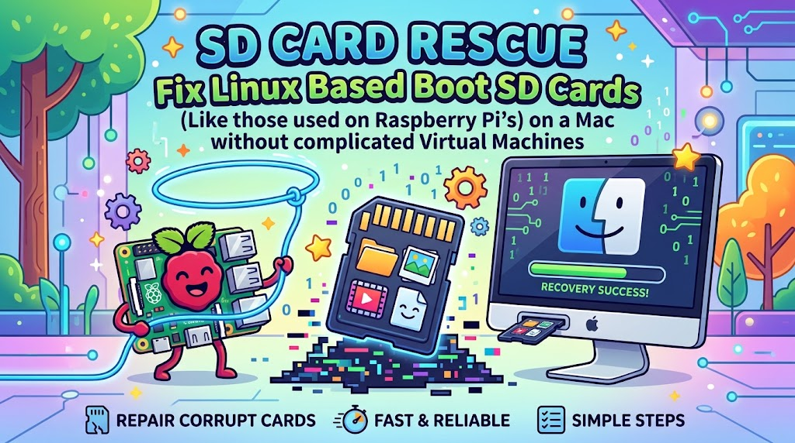
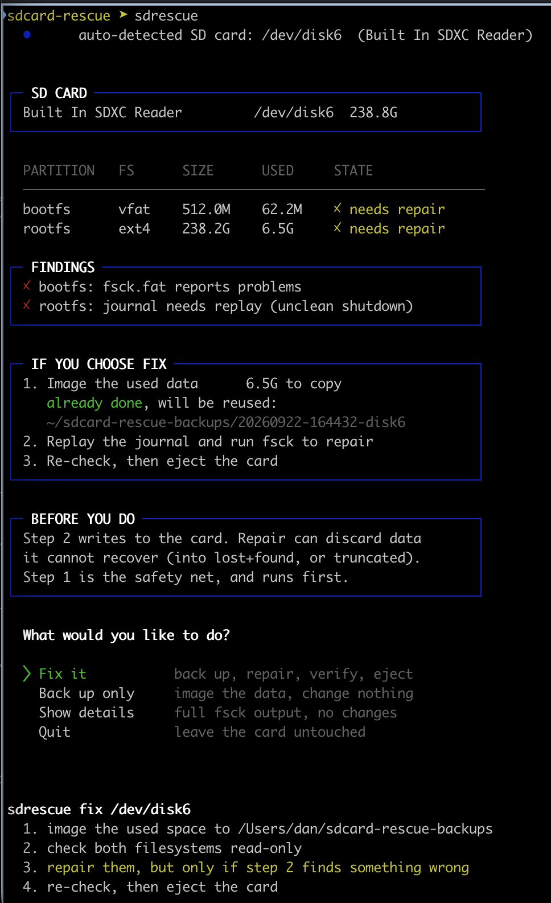
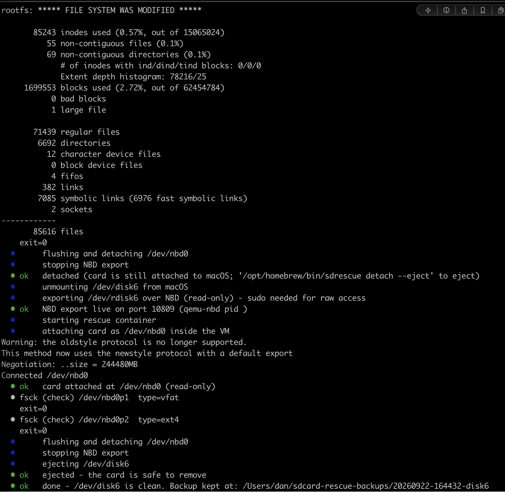

# sd-rescue

[](LICENSE)
[](#requirements)
[](sdrescue)
[](https://github.com/abiosoft/colima)
[](https://github.com/voycey/sd-rescue/commits/main)

Fix Linux boot SD cards (the kind a Raspberry Pi uses) from a Mac, with one command.

Fixing Linux based SD cards on macOS is a pain in the ass of virtual machines and Linux mounting of Mac peripherals. I needed something that could quickly fsck and fix several microSD cards that had failed after a power failure on my RPi 5 cluster. This is that utility.

## What it looks like

`sdrescue` inspects the card read-only, shows what is wrong, and asks before it changes anything:



Pick Fix it and it backs up the used data, replays the journal, runs fsck, checks the card again and ejects it:



## How it works

macOS cannot read ext4, and its FAT driver will happily mount and write to a card you are trying to save. So the card is unmounted from macOS, exported over NBD with `qemu-nbd`, and attached as `/dev/nbd0` inside a privileged container in the [Colima](https://github.com/abiosoft/colima) VM. `e2fsck`, `fsck.fat` and `partclone` then work on the real device, partitions and all.

The export is read-only unless you ask for a repair, and the NBD port is bound to localhost. Because the tools talk to the actual card rather than a copy, a repair writes only the blocks fsck changes. There is no multi-hour write-back of a 256 GB image.

## Requirements

- macOS with an SD card reader (built-in or USB)
- [Colima](https://github.com/abiosoft/colima) and Docker: `brew install colima docker`
- `qemu-nbd`: `brew install qemu`
- `sudo`, for raw access to the card

## Install

```sh
git clone git@github.com:voycey/sd-rescue.git
ln -s "$PWD/sd-rescue/sdrescue" /opt/homebrew/bin/sdrescue
```

The rescue container image builds itself on first run.

## Usage

```sh
sdrescue
```

That is all of it. The inserted SD card is found by bus protocol (`Secure Digital` for the built-in reader, or a removable disk whose media name looks like a card reader for USB ones). With two cards inserted it refuses to guess.

For scripts, the same job without the menu:

```sh
sdrescue fix --yes
```

Individual steps, if you want them:

| command | what it does |
| --- | --- |
| `sdrescue info` | partition table and filesystem state, read-only |
| `sdrescue backup` | image the used space to `~/sdcard-rescue-backups/` |
| `sdrescue check` | read-only fsck, reports what is wrong |
| `sdrescue verify` | boot-readiness checks that fsck does not do (below). `--deep` also checksums every package file |
| `sdrescue repair` | fsck with repairs. Refuses to run without a backup |
| `sdrescue mount` | mount the partitions read-only for browsing |
| `sdrescue shell` | a shell in the rescue container with the card attached |
| `sdrescue restore <backup-dir>` | write a backup back onto a card |
| `sdrescue detach --eject` | tear down the export and eject the card |

All of these take an optional disk argument (`sdrescue info disk6`) when you want to name the card yourself. It is always the whole disk, never a partition.

## Verify

A clean fsck means the metadata is consistent, not that the card will boot. `sdrescue verify` mounts both partitions read-only and checks what the Pi's boot chain needs: `config.txt`, `cmdline.txt`, a kernel, device trees and initramfs on the boot partition; that `root=` in `cmdline.txt` and every entry in `/etc/fstab` point at this card's PARTUUIDs; that the kernel version in the boot image has a matching `/lib/modules` directory (the usual casualty of an upgrade cut off by a power failure); that systemd, the account files and the SSH host keys are present and not zero-length; that no file in `/etc` is NUL-filled; that dpkg was not interrupted and no package is half-installed; and what fsck left in `lost+found`. `fix` runs these after the repair.

`sdrescue verify --deep` also checks every installed package file against dpkg's md5sums, which is the closest thing to proof that the file contents survived. It reads most of the used space, so give it the time.

The firmware stage of a Pi boot cannot be tested off the Pi, and QEMU has no Pi 5 machine, so this stops short of an actual boot.

## Backups

A backup lands in `~/sdcard-rescue-backups/<timestamp>-<disk>/` and holds the ext4 partition as a partclone image of used blocks only, a raw copy of the boot partition, the MBR and partition table, a manifest and checksums. A 256 GB card with 7 GB in use gives a 7 GB backup. `repair` will not run unless the manifest says `status: complete`.

## Safety

The card is unmounted from macOS first, and the NBD export is read-only unless you chose Fix, repair or restore. Non-removable and virtual disks are refused. Repair needs a complete backup and a typed confirmation, and restore needs a typed confirmation because it overwrites the card. If a filesystem has no readable superblock anywhere, the tool stops rather than running `e2fsck` on it, since past that point a repair only makes recovery harder.

fsck fixing the filesystem does not mean the card is healthy. Once the Pi boots, copy off what matters and consider writing a fresh card.

## License

[MIT](LICENSE)
